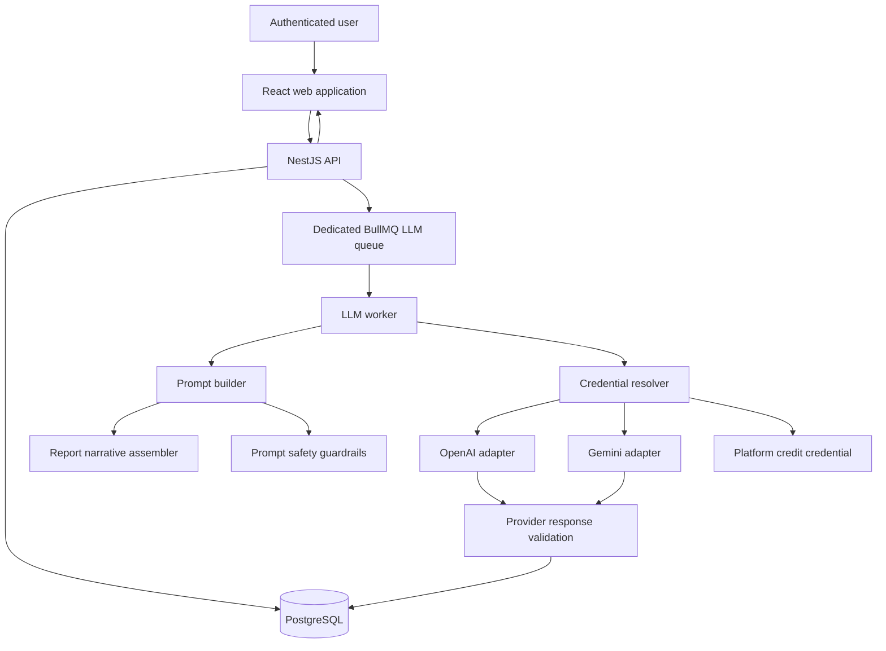

# LLM Prompt Generation and Preview Design

**Date:** 2026-07-16
**Status:** Approved design pending written-spec review
**Scope:** Hybrid prompt generation from extraction reports, provider connections, limited LLM preview, dedicated queue, security guardrails, tests, and operational maturity

## 1. Objective

Extend ExtractionStack so an authenticated user can transform an evidence-based extraction report into a reusable prompt for a broad creation task. The user can start from a guided wizard, add free-form instructions, generate a universal prompt, adapt it to a target tool, and run a limited preview with an LLM.

The feature must support three credential and billing modes:

1. provider OAuth when the provider supports model inference through OAuth;
2. a user-supplied API key or service credential;
3. ExtractionStack-managed credits as a paid fallback.

The primary user-facing output is always natural language. Structured JSON remains an internal implementation detail for validation, persistence, reliable rendering, and automated testing.

## 2. Product Boundaries

### 2.1 Included in the first delivery

- A wizard for common creation categories: application, landing page, frontend, backend, API, design system, documentation, tests, content, and custom.
- A free-form instructions field available alongside the wizard.
- Generation and immutable versioning of a universal prompt.
- Adaptation of a universal prompt for a selected destination such as Codex, ChatGPT, Claude, Gemini, Cursor, Lovable, or Bolt.
- A limited preview executed by the selected model provider.
- Connection management for supported provider credentials.
- ExtractionStack credits with explicit cost consent.
- A dedicated BullMQ queue and worker for LLM jobs.
- Provider adapters behind a stable application interface.
- Prompt-injection defenses, secret protection, ownership checks, abuse limits, and cost controls.
- Unit, integration, contract, worker, security, and browser E2E tests.
- Metrics, alerts, dead-letter handling, replay, health checks, and operational documentation.

### 2.2 Explicitly excluded

- Autonomous agents.
- LLM tool calling or arbitrary code execution.
- Full project creation or deployment.
- Automatic paid fallback without prior user consent.
- Sending raw target HTML to a provider.
- Inferring that an identity login grants access to a model provider.
- OpenAI inference OAuth unless OpenAI exposes and documents such a capability in the future.
- Active security testing of extracted websites or third-party providers.

## 3. Success Criteria

The delivery is successful when:

1. A report owner can generate a universal prompt from an extraction through the wizard and optional free instructions.
2. The generated prompt and preview are displayed as readable natural language, never as raw JSON.
3. A prompt can be adapted without mutating its source version.
4. A preview always references the exact immutable prompt version, provider, model, and connection mode used.
5. OpenAI can be used through a user API key or ExtractionStack credits.
6. Gemini can be used through OAuth, a user API key, or ExtractionStack credits.
7. Adding, validating, using, revoking, and deleting a provider connection never exposes its secret after submission.
8. Extraction content is treated as untrusted data and cannot replace system or user instructions.
9. Cross-user access, SQL injection, prompt injection, XSS, CSRF, OAuth tampering, secret leakage, credit duplication, and rate-limit bypass have automated regression coverage.
10. Provider failures, retries, cancellation, and worker restarts produce consistent terminal job states without duplicate charges.
11. CI uses deterministic provider doubles and performs no paid inference calls.
12. Operational metrics expose reliability, latency, token usage, cost, and queue behavior without recording full prompts or credentials.

## 4. Architectural Approach

ExtractionStack remains a modular monolith with separately deployable processes. LLM work is isolated from the extraction crawler because the two workloads have different resource, concurrency, timeout, retry, and security profiles.

### 4.1 Deployment units

- `apps/web`: wizard, connection management, prompt editor, version history, preview, cost consent, and natural-language results.
- `apps/api`: authentication, authorization, validation, prompt project lifecycle, connection metadata, job submission, reads, cancellation, and audit.
- `apps/worker`: existing Chromium extraction worker.
- `apps/llm-worker`: dedicated LLM worker consuming a separate BullMQ queue.
- PostgreSQL: prompt projects, versions, jobs, previews, encrypted credential envelopes, usage, security decisions, credit ledger, and audit events.
- Redis/BullMQ: durable LLM jobs, locks, retry state, cancellation signals, and queue coordination.

### 4.2 Module boundaries

- `extractions`: owns evidence-based reports and report authorization.
- `ai-connections`: owns provider connections, credential envelopes, OAuth state, validation, rotation, and revocation.
- `prompt-generation`: owns wizard inputs, report narrative assembly, prompt composition, prompt versions, and adaptations.
- `llm-runtime`: owns provider capability registry, credential resolution, adapters, execution, usage normalization, timeout, retry, cancellation, and circuit breaking.
- `prompt-safety`: owns input classification, redaction, prompt-injection detection, size limits, output validation, and security decisions.
- `credits`: owns balance, reservations, confirmations, reversals, and financial audit.

Each module exposes application services and typed contracts. Controllers remain thin. Provider SDKs, Prisma, BullMQ, and encryption libraries remain infrastructure details outside domain rules.

### 4.3 Architecture diagram



## 5. User Experience

### 5.1 Entry point

An extraction detail page gains a `Gerar prompt` action. Only the report owner or an authorized administrator can start the flow.

### 5.2 Wizard

The wizard collects:

1. creation category;
2. objective and expected deliverable;
3. target audience;
4. desired technologies and explicit exclusions;
5. functional and non-functional requirements;
6. desired depth, tone, language, and output format;
7. destination tool;
8. free-form instructions;
9. provider, model, and credential mode for the optional preview;
10. data-sharing and cost confirmation.

Every step supports back navigation without losing data. The final review shows the provider, selected report sections, estimated tokens, estimated charge or credits, retention summary, and whether the preview is enabled.

### 5.3 Prompt workspace

After generation the user sees:

- the universal prompt in an editable natural-language view;
- confidence-aware context derived from the extraction;
- adaptations grouped by destination;
- immutable version history;
- generation metadata without secrets;
- a limited preview and its status;
- copy and text/Markdown export actions.

Editing and saving creates a new version. Existing versions and previews are never overwritten.

### 5.4 Natural-language contract

The following user-facing surfaces must never render raw internal JSON:

- extraction report narrative;
- generated universal prompt;
- destination adaptation;
- preview result;
- validation and provider errors;
- security rejection explanations.

Internal structured responses may be required from providers for deterministic validation. A presentation mapper must convert validated data to natural language before it crosses the public API contract. Debug endpoints must not bypass this rule.

## 6. Prompt Construction and Data Flow

### 6.1 Generation flow

1. The API authenticates the user and verifies ownership of the extraction.
2. Shared Zod contracts validate the wizard, free instructions, destination, and preview configuration.
3. The API creates a `PromptProject` and a `PromptGenerationJob` transactionally.
4. If platform credits are used, the credits module creates an idempotent reservation.
5. The API enqueues the job and returns `202 Accepted`.
6. The LLM worker loads only the authorized, bounded report projection.
7. `ReportNarrativeAssembler` converts evidence into a safe natural-language source brief.
8. `PromptSafetyService` removes secrets, delimits extracted content as data, and records any security decision.
9. `PromptComposer` combines platform policy, user intent, the safe source brief, and destination requirements in separate instruction layers.
10. `CredentialResolver` selects the explicitly authorized connection mode.
11. The provider adapter performs generation with timeout, cancellation support, and normalized usage accounting.
12. Internal output is validated through a strict schema and converted to the natural-language public representation.
13. The worker persists the immutable prompt version, usage, preview, audit, and terminal job state transactionally where possible.
14. Platform-credit reservation is confirmed for billable success or reversed for a non-billable failure.

### 6.2 Source brief rules

`ReportNarrativeAssembler` must:

- select fields from an explicit allowlist;
- preserve evidence provenance and confidence;
- state `não identificado` instead of inventing missing technology;
- distinguish confirmed facts, strong indications, hypotheses, and limitations;
- omit raw HTML, cookie values, authorization data, query secrets, and unnecessary identifiers;
- normalize and bound URLs and headers before inclusion;
- truncate by semantic section rather than cutting arbitrary bytes;
- mark every extracted passage as untrusted reference data;
- ignore instructions discovered inside the extracted content.

### 6.3 Prompt layers

The prompt is assembled from immutable, separately typed layers:

1. platform safety and output policy;
2. task definition from the wizard;
3. free-form user instructions;
4. delimited extraction source brief;
5. destination-specific adaptation rules;
6. internal response contract.

Extracted content is never concatenated into the platform instruction layer. The adapter receives typed messages or provider-equivalent roles, not one unstructured string assembled by a controller.

## 7. Provider and Credential Model

### 7.1 Identity versus inference authorization

Application authentication proves who the ExtractionStack user is. A provider connection separately proves that a provider may be used for inference. Signing in through Google or another identity provider does not automatically grant model access.

OpenAI's public API authentication is designed around API keys, so the initial OpenAI adapter supports user API keys and platform credits. Gemini supports OAuth and API keys, so its adapter supports all three modes. Provider capabilities must be read from a registry rather than hard-coded in UI conditionals.

Official references:

- OpenAI API authentication: <https://platform.openai.com/docs/api-reference/authentication>
- Gemini OAuth: <https://ai.google.dev/gemini-api/docs/oauth>
- Gemini API keys: <https://ai.google.dev/gemini-api/docs/api-key>

### 7.2 Provider adapter contract

```ts
interface LlmProviderAdapter {
  readonly provider: LlmProvider;
  getCapabilities(): ProviderCapabilities;
  validateConnection(input: ValidateConnectionInput): Promise<ConnectionValidation>;
  estimateUsage(input: GenerationInput): Promise<UsageEstimate>;
  generatePrompt(input: GenerationInput): Promise<NormalizedGeneration>;
  generatePreview(input: PreviewInput): Promise<NormalizedPreview>;
  cancel?(providerRequestId: string): Promise<void>;
}
```

The application depends on this interface, never directly on a provider SDK. All adapters must normalize usage, finish reason, request identifier, retryability, and public error category.

### 7.3 Capability registry

The registry declares, per provider:

- supported credential modes;
- available models configured by the platform;
- context and output limits;
- structured-output support;
- cancellation support;
- OAuth scopes and refresh support;
- preview eligibility;
- pricing metadata version used for estimates;
- feature-flag and circuit-breaker state.

Model lists and prices are configuration with an effective date, not assumptions embedded in code. The design deliberately does not prescribe a permanent model identifier.

## 8. Domain and Persistence Model

### 8.1 `AiConnection`

- owner, provider, display label, and credential mode;
- state: `PENDING | ACTIVE | EXPIRED | REVOKED | INVALID`;
- masked credential metadata, scopes, expiry, validation time, and last-used time;
- encrypted credential reference;
- unique constraints preventing ambiguous active connections where required.

### 8.2 `ProviderCredential`

- one encrypted envelope per credential version;
- ciphertext, encrypted data-encryption key, algorithm, key version, and authenticated metadata;
- no plaintext, complete suffix, or refresh token in ordinary application fields;
- rotation and deletion timestamps.

### 8.3 `PromptProject`

- owner and source extraction;
- normalized wizard configuration;
- title, creation category, language, and current version pointer;
- timestamps and soft lifecycle state.

### 8.4 `PromptVersion`

- immutable sequence number per project;
- source version for adaptations;
- universal or destination-adapted type;
- natural-language content;
- bounded structured metadata for provenance and rendering;
- prompt template version, source report schema version, provider, and model metadata;
- content hash for integrity and deduplication.

### 8.5 `PromptGenerationJob`

- owner, project, requested operation, provider, model, connection mode, idempotency key;
- states: `QUEUED | RUNNING | SUCCEEDED | FAILED | CANCEL_REQUESTED | CANCELLED`;
- bounded attempts, timestamps, sanitized error code, and retryable flag;
- optional exact source and resulting prompt-version references.

### 8.6 `PromptPreview`

- exact prompt version;
- natural-language request summary and result;
- provider, model, status, finish reason, bounded latency, and usage reference;
- no credential material and no provider response dump.

### 8.7 `LlmUsage`

- job, provider, model, credential mode;
- normalized input, output, cached, and total token counts where available;
- estimated and confirmed monetary/credit amount with currency and pricing-version metadata;
- provider request ID stored only when operationally necessary and bounded.

### 8.8 `SecurityDecision`

- job, decision type, action, policy version, bounded reason code, and safe metadata;
- no rejected secret or complete prompt body;
- supports audit and guardrail metrics.

### 8.9 `CreditLedger`

- append-only entries for grant, purchase, reservation, confirmation, reversal, and adjustment;
- idempotency key and causal job reference;
- integer minor units, never floating-point currency;
- transactional balance invariant and administrative audit.

Deleting a connection revokes credential use but does not delete prompt history. Deleting a user or project follows the product retention policy and preserves only financial/audit records required by policy.

## 9. HTTP API

All endpoints require authentication except provider OAuth callbacks that use a short-lived, signed, one-time state linked to an authenticated initiation.

### 9.1 Connections

- `GET /api/ai/providers` — capability registry safe for the current user.
- `GET /api/ai/connections` — connection metadata with masked values only.
- `POST /api/ai/connections/api-key` — submit and validate a provider API key.
- `POST /api/ai/connections/:provider/oauth/start` — create state, PKCE verifier, nonce, and exact redirect.
- `GET /api/ai/connections/:provider/oauth/callback` — validate and exchange the one-time authorization response.
- `POST /api/ai/connections/:id/validate` — revalidate without returning the credential.
- `DELETE /api/ai/connections/:id` — revoke locally and at the provider when supported.

### 9.2 Prompt projects and jobs

- `POST /api/prompt-projects` — create a project from an owned extraction.
- `GET /api/prompt-projects` — cursor-paginated owned projects.
- `GET /api/prompt-projects/:id` — project, safe configuration, and version summary.
- `POST /api/prompt-projects/:id/generations` — generate a universal prompt.
- `POST /api/prompt-versions/:id/adaptations` — create an immutable destination adaptation.
- `POST /api/prompt-versions/:id/previews` — run a limited preview after data/cost consent.
- `GET /api/prompt-jobs/:id` — job status and natural-language result when complete.
- `POST /api/prompt-jobs/:id/cancel` — request cancellation.

Mutation endpoints require an `Idempotency-Key`. Ownership is enforced in repository predicates. Inaccessible and absent resources return the same public response to reduce identifier enumeration.

## 10. Security and Guardrails

### 10.1 Prompt injection and untrusted content

- Extracted content and provider responses are untrusted.
- Report fields pass through allowlisting, normalization, redaction, size limits, and explicit data delimiters.
- Platform, user, source-data, and destination instructions remain separate.
- Detected instructions in source content are recorded and ignored.
- No tool calling, network access, filesystem access, or code execution is exposed to the model in this scope.
- Internal structured output is validated before persistence and natural-language rendering.
- Unsafe or malformed output fails closed with a sanitized explanation.

### 10.2 Credential security

- Provider credentials use envelope encryption with a per-credential data-encryption key.
- The master key resides in a production secret manager and is versioned for rotation.
- Ciphertext is authenticated with owner, provider, and credential-version metadata.
- Plaintext exists only in bounded memory during validation or a provider request and is never logged.
- Public API responses expose only provider, label, safe masked suffix, scopes, expiry, state, and last use.
- OAuth uses authorization code flow, PKCE, unpredictable state, nonce where applicable, exact redirect URIs, one-time callbacks, short expiry, and account-linking checks.
- Revocation invalidates the local connection immediately even when the provider revoke call fails.

### 10.3 SQL injection and input validation

- Prisma parameterized operations are the default persistence mechanism.
- `$queryRawUnsafe` and `$executeRawUnsafe` are forbidden by static regression test.
- Dynamic sort, filters, provider, model, state, and pagination fields use Zod enum allowlists.
- DTO schemas are strict, bounded, and reject unknown keys.
- IDs, idempotency keys, OAuth values, free instructions, prompt text, and cursor inputs have explicit limits.
- Credit operations are transactional and idempotent.
- No user-controlled database identifier is interpolated into SQL.

### 10.4 Web and authorization controls

- Every query includes owner scope unless an explicit admin policy applies.
- CSRF protection covers cookie-authenticated mutations; bearer-token deployments enforce origin and CORS policy.
- Natural-language output is rendered as text, never trusted HTML.
- CSP, HSTS, anti-framing, content-type, referrer, permissions, and cache headers are configured by environment.
- API errors expose stable codes and request IDs without stack, path, SDK payload, SQL detail, or secret.
- Sensitive fields are redacted centrally from logs and traces.

### 10.5 Abuse and financial controls

- Rate limits apply by user, source IP, connection, provider, and operation class.
- Per-user active-job, daily token, daily credit, prompt-size, response-size, and preview limits are configurable.
- Platform credits are reserved before enqueue or execution according to the final implementation plan.
- Paid fallback requires explicit prior consent and a declared maximum.
- Retries only cover classified transient failures and never independently duplicate a financial confirmation.
- Provider timeouts use bounded exponential backoff with jitter and a circuit breaker.

### 10.6 Privacy and data sharing

Before preview execution, the user sees:

- provider and model;
- credential mode;
- report sections that will be shared;
- a natural-language data summary;
- estimated token usage and cost;
- retention notice;
- explicit confirmation when platform credits may be charged.

The default payload uses the minimal safe report summary. Raw HTML, private cookies, authentication headers, and unrelated evidence are never sent.

## 11. Error Handling and Job Semantics

Public error categories include:

- `VALIDATION`, `UNAUTHENTICATED`, `FORBIDDEN`, `NOT_FOUND`;
- `CONFLICT`, `RATE_LIMITED`, `PAYLOAD_TOO_LARGE`;
- `CONNECTION_INVALID`, `CONNECTION_EXPIRED`, `PROVIDER_UNAVAILABLE`;
- `MODEL_UNAVAILABLE`, `CONTEXT_LIMIT`, `GUARDRAIL_REJECTED`;
- `INSUFFICIENT_CREDITS`, `COST_LIMIT_EXCEEDED`;
- `LLM_TIMEOUT`, `LLM_OUTPUT_INVALID`, `QUEUE_UNAVAILABLE`, `INTERNAL`.

Errors shown to users are concise natural-language messages mapped from stable codes. Provider exception bodies are never forwarded directly.

Jobs follow guarded transitions. A cancellation request is best-effort for an in-flight provider call, but the worker must stop further persistence and charging where the provider outcome is not billable. Late provider responses cannot overwrite a terminal cancelled or superseded state. Worker processing is idempotent by job ID and attempt.

Retry rules:

- retry rate limits, timeouts, temporary network failures, and documented provider server failures;
- do not retry validation, authentication, authorization, insufficient credit, guardrail, or context-limit failures without a changed input;
- respect provider retry hints within configured bounds;
- move exhausted jobs to a dead-letter state with a safe replay path.

## 12. Testing Strategy

### 12.1 Unit tests

- report selection, narrative assembly, confidence wording, and semantic truncation;
- prompt-layer composition and destination adaptations;
- prompt-injection detection and instruction/data isolation;
- secret redaction and credential envelope handling;
- OAuth state, PKCE, nonce, expiry, and replay logic;
- credential resolution for OAuth, API key, and platform credit modes;
- provider capability and model allowlists;
- adapter normalization and response validation;
- token/cost estimation and pricing-version behavior;
- credit reservation, confirmation, reversal, and duplicate-event handling;
- job state transitions, retries, cancellation, and circuit breaker;
- public natural-language mappers and sanitized errors;
- immutable prompt versioning and content hashes.

### 12.2 Integration tests

- Prisma repositories against isolated PostgreSQL;
- BullMQ behavior against isolated Redis namespaces;
- API routes with actual validation, guards, ownership, services, and repositories;
- encrypted credential round-trip with a test key provider;
- OAuth initiation and callback using a deterministic local provider double;
- transaction rollback across prompt persistence, usage, and credit operations;
- worker restart, retry, cancellation, dead-letter, and replay;
- rate limiting and concurrency limits;
- natural-language public response contracts.

### 12.3 Provider contract tests

Every adapter runs the same suite for:

- connection validation;
- capability discovery;
- usage estimation;
- prompt generation;
- preview generation;
- normalized finish reasons and usage;
- transient and permanent errors;
- timeout and cancellation behavior where supported;
- malformed and oversized responses.

CI uses a deterministic fake provider. Optional real-provider smoke tests require an explicit environment flag, dedicated low-privilege credentials, a strict monetary ceiling, and a non-PR execution context.

### 12.4 Browser E2E tests

1. Extraction detail to wizard to universal prompt to preview to copy/export.
2. Wizard navigation, validation, free instructions, and restored draft.
3. Platform-credit consent and successful ledger confirmation.
4. Gemini OAuth connection using a provider double.
5. API-key connection, validation, masking, use, revocation, and deletion.
6. Prompt regeneration, immutable history, and destination adaptation.
7. Provider failure, retry feedback, cancellation, and recovery.
8. Insufficient credit and cost-limit rejection.
9. Accessibility for keyboard operation, focus, labels, status announcements, and reduced motion.
10. Confirmation that main outputs are natural language and raw JSON is absent.

### 12.5 Security regression tests

- SQL-injection payloads in all identifiers, text, filters, cursors, OAuth inputs, and idempotency keys;
- static scan for unsafe Prisma raw-query APIs;
- cross-user IDOR attempts for connections, projects, versions, jobs, previews, usage, and credits;
- prompt-injection instructions embedded in extraction evidence;
- attempts to make source content replace platform policy;
- stored and reflected XSS payloads rendered inert;
- invalid CSRF, OAuth state, nonce, redirect URI, callback replay, and account mismatch;
- secrets absent from browser state, API responses, error bodies, logs, metrics, traces, and snapshots;
- rate-limit, concurrent-job, payload, token, output, and cost-budget bypass attempts;
- malformed Unicode, deep JSON, prototype-pollution keys, and oversized provider output;
- SSRF-like URLs in extracted content remain plain data and are never fetched by the LLM worker;
- duplicate enqueue, retry, callback, and provider response cannot duplicate charges.

These tests exercise ExtractionStack-owned interfaces and doubles only. They do not attack external systems.

## 13. Observability and Operational Maturity

### 13.1 Logs and traces

- Structured logs correlate request, user subject hash, project, prompt job, queue attempt, provider, model, and result.
- Prompt bodies, extraction narratives, credentials, OAuth tokens, provider response bodies, and complete user instructions are excluded.
- Traces use safe attributes and record queue wait, prompt assembly, provider call, validation, persistence, and ledger duration.
- Security decisions are auditable through bounded reason codes.

### 13.2 Metrics

- queued, active, delayed, succeeded, failed, cancelled, and dead-letter jobs;
- queue wait and end-to-end duration;
- provider request latency, availability, timeouts, and normalized failures;
- input, output, cached, and total tokens by provider/model/mode;
- estimated versus confirmed cost or credits;
- retry, cancellation, circuit-breaker, and guardrail rates;
- credential validation, expiry, refresh, and revocation outcomes;
- credit reservations, confirmations, reversals, and invariant failures.

Metrics use bounded labels and never include user IDs, prompt IDs, raw URLs, prompt content, or exception messages.

### 13.3 Health, alerting, and runbooks

- API readiness verifies PostgreSQL, Redis, and queue connectivity.
- LLM-worker readiness verifies PostgreSQL, Redis, queue registration, encryption-key availability, and adapter configuration without performing paid calls.
- Liveness remains local and does not depend on providers.
- Alerts cover queue age, failure rate, provider degradation, circuit opening, credit invariant failure, unexpected cost, credential-decryption failure, and dead-letter growth.
- Runbooks cover provider outage, compromised credential, billing anomaly, queue backlog, stuck job, encryption-key rotation, replay, and data-deletion requests.
- Administrative replay is explicit, authorized, audited, idempotent, and protected from duplicate charging.

### 13.4 Initial SLOs

- API monthly availability target: 99.5%.
- 95% of healthy jobs start within 30 seconds.
- 95% of ordinary prompt generations finish within 90 seconds, excluding a documented provider-wide incident.
- zero credential exposure in public responses and production logs;
- zero duplicate charges from retries or repeated requests;
- active jobs recover consistently after worker restart;
- material operational degradation alerts within five minutes.

SLO values are initial measurement targets and will be recalibrated from production telemetry.

## 14. Cost and Credit Controls

The review step shows provider, model, credential mode, report sections, estimated input/output tokens, estimate timestamp, pricing metadata version, estimated amount, maximum accepted amount, and retention notice.

The credit ledger uses integer minor units and the lifecycle:

```text
reservation -> provider execution -> confirmation
                              \----> reversal on non-billable failure
```

The confirmed amount records actual normalized usage where the provider exposes it. Differences beyond a configured threshold create an operational signal. The platform never converts a user-key job into a platform-credit job silently. Credit adjustments require an audited administrative reason.

## 15. Rollout Strategy

1. Ship schemas, persistence, interfaces, fake provider, guardrails, metrics, and tests behind disabled feature flags.
2. Enable internal platform-credit generation with low token and budget limits.
3. Enable user API keys for OpenAI and Gemini.
4. Enable Gemini OAuth after callback, refresh, revocation, and account-linking tests pass.
5. Enable wizard, free instructions, universal prompt, adaptations, and limited preview for internal users.
6. Run a controlled pilot with per-user quotas and a global cost ceiling.
7. Expand progressively by cohort while monitoring SLOs, security decisions, queue behavior, and cost variance.
8. Add new providers only after their adapter passes the common contract and security suites.

Every provider and credential mode has an independent feature flag and kill switch. Database migrations are backward compatible during rollout. Rollback disables new submissions while preserving reads and terminal job processing where safe.

## 16. Documentation Deliverables

Implementation must update or add:

- architecture documentation and Mermaid topology;
- provider adapter and capability-registry guide;
- natural-language output contract;
- credential lifecycle and encryption-key rotation documentation;
- security threat model and guardrail matrix;
- credit and cost-accounting invariants;
- API contracts and public error catalog;
- test strategy and optional real-provider smoke-test procedure;
- operations dashboard, alerts, SLOs, retention policy, and incident runbooks;
- local-development instructions using provider doubles by default.

## 17. Key Trade-offs

- A dedicated worker adds one deployable process but prevents LLM latency and provider failures from competing with Chromium extraction capacity.
- Provider adapters add an abstraction layer but prevent SDK details and credential modes from leaking into application rules.
- Internal structured output improves validation, while natural-language presentation satisfies the product contract. The additional mapper is deliberate.
- Envelope encryption and a ledger increase implementation effort but are necessary for reusable credentials and platform-funded inference.
- Immutable prompt versions consume more storage but provide reproducibility, auditability, and safe preview provenance.
- A limited preview delivers user value without introducing the risk and operational scope of autonomous execution.

## 18. Acceptance Gate

Before general availability:

1. lint, typecheck, unit, integration, contract, security, E2E, and production build checks pass;
2. no paid real-provider call runs in ordinary CI;
3. the credential-leak suite passes across UI, API, logs, metrics, traces, and snapshots;
4. injection and ownership suites pass;
5. duplicate-job and duplicate-charge chaos cases pass;
6. dashboards, alerts, kill switches, rotation, replay, and incident runbooks are exercised in staging;
7. all primary outputs are verified as natural language;
8. provider-specific authentication modes match documented provider capabilities;
9. a controlled pilot remains inside the configured reliability and cost thresholds;
10. rollback and data-recovery procedures are demonstrated.

